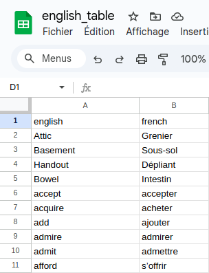

# English vocabulary quiz

This project is a little quiz game, which retrieves data from a Google sheet, that looks like this:



and asks user their answer and gives a final score.
The goal is to easily add new words in the Google sheet, and to improve in terms of vocabulary.

```shell
poetry install --no-root
eval $(poetry env activate)
export FILE_ID=$FILE_ID
export API_KEY=$API_KEY
.venv/bin/python english_quiz/application/main.py
```
